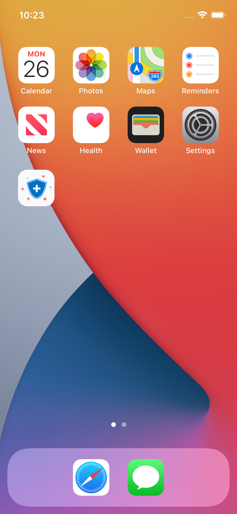

## Instrucciones para Ejecutar la Aplicación

### Paso 1: Configurar el Emulador (para Android)

Si aún no tiene un emulador configurado, siga estos pasos:

1. Inicie Android Studio.
2. En Android Studio, vaya a "AVD Manager" (Administrador de dispositivos virtuales de Android).
3. Cree un nuevo emulador virtual o elija uno existente.
4. Inicie el emulador.

### Paso 2: Instalar Dependencias

Abra una terminal en la raíz del proyecto y ejecute el siguiente comando para instalar las dependencias necesarias:

2. Ejectuar npm install
3. Ejecutar npx expo start
4. Precionar tecla "a" (para ejecutar en android)

#### Imagenes Proyecto

